# GitHub Workflows Architecture Diagram

## Complete Workflow Dependency Flow

```mermaid
graph TD
    %% Triggers
    PUSH[Push to main] --> CI
    PR[Pull Request] --> CI
    SCHEDULE[Monday 9 AM UTC] --> DEPS
    MANUAL_RELEASE[Manual: Release & Publish] --> RELEASE
    MANUAL_DEPS[Manual: Dependencies] --> DEPS
    MANUAL_EMERGENCY[Manual: Emergency Publish] --> EMERGENCY
    
    %% CI Workflow
    subgraph CI ["🔄 Continuous Integration"]
        CI_QA[🧪 Quality Assurance & Testing]
        CI_DEPENDABOT[🤖 Auto-merge Dependabot PRs]
        
        CI_QA --> CI_DEPENDABOT
    end
    
    %% Release & Publish Workflow
    subgraph RELEASE ["🚀 Release & Publish Package"]
        REL_VALIDATION[🔍 Pre-Release Validation & Testing]
        REL_CREATE[🏷️ Create GitHub Release]
        REL_PUBLISH[📦 Publish Package to Registries]
        REL_NOTIFY[📣 Send Release Completion Notifications]
        
        REL_VALIDATION --> REL_CREATE
        REL_CREATE --> REL_PUBLISH
        REL_PUBLISH --> REL_NOTIFY
    end
    
    %% Dependencies Workflow
    subgraph DEPS ["🔒 Dependency Security & Updates"]
        DEPS_AUDIT[🔒 Security Vulnerability Audit]
        DEPS_UPDATE[🔄 Update Outdated Dependencies]
        
        DEPS_AUDIT --> DEPS_UPDATE
    end
    
    %% Emergency Publish Workflow
    subgraph EMERGENCY ["🆘 Emergency Hotfix Publisher"]
        EMERGENCY_PUBLISH[🚨 Execute Emergency Hotfix Publication]
        EMERGENCY_BLOCK[🚫 Block Invalid Emergency Publication Request]
    end
    
    %% External Dependencies
    NPM_REGISTRY[(NPM Registry)]
    GITHUB_PACKAGES[(GitHub Packages)]
    GITHUB_RELEASES[(GitHub Releases)]
    
    %% Workflow Dependencies
    REL_PUBLISH --> NPM_REGISTRY
    REL_PUBLISH --> GITHUB_PACKAGES
    REL_CREATE --> GITHUB_RELEASES
    EMERGENCY_PUBLISH --> NPM_REGISTRY
    
    %% Conditional Dependencies
    DEPS_UPDATE -.->|Creates PR| CI
    CI_DEPENDABOT -.->|Auto-merge if tests pass| DEPS_UPDATE
    
    %% Styling
    classDef workflow fill:#e1f5fe,stroke:#0288d1,stroke-width:2px
    classDef job fill:#f3e5f5,stroke:#7b1fa2,stroke-width:2px
    classDef external fill:#e8f5e8,stroke:#2e7d32,stroke-width:2px
    classDef trigger fill:#fff3e0,stroke:#f57c00,stroke-width:2px
    
    class CI,RELEASE,DEPS,EMERGENCY workflow
    class CI_QA,CI_DEPENDABOT,REL_VALIDATION,REL_CREATE,REL_PUBLISH,REL_NOTIFY,DEPS_AUDIT,DEPS_UPDATE,EMERGENCY_PUBLISH,EMERGENCY_BLOCK job
    class NPM_REGISTRY,GITHUB_PACKAGES,GITHUB_RELEASES external
    class PUSH,PR,SCHEDULE,MANUAL_RELEASE,MANUAL_DEPS,MANUAL_EMERGENCY trigger
```

## Workflow Trigger Analysis

### No Circular Dependencies ✅

## Job Dependencies Within Workflows

### 🚀 Release & Publish Package Flow

```mermaid
graph TD
    START[Manual Trigger] --> VALIDATE{Skip Tests?}
    
    VALIDATE -->|No| REL_VALIDATION[🔍 Pre-Release Validation]
    VALIDATE -->|Yes| REL_CREATE[🏷️ Create GitHub Release]
    
    REL_VALIDATION --> REL_CREATE
    REL_CREATE --> DRY_RUN{Dry Run Mode?}
    
    DRY_RUN -->|No| REL_PUBLISH[📦 Publish to Registries]
    DRY_RUN -->|Yes| REL_NOTIFY[📣 Send Notifications]
    
    REL_PUBLISH --> REL_NOTIFY
    
    %% Parallel Publishing
    REL_PUBLISH --> NPM[📦 Publish to NPM]
    REL_PUBLISH --> GITHUB[📦 Publish to GitHub Packages]
    
    NPM --> REL_NOTIFY
    GITHUB --> REL_NOTIFY
    
    classDef job fill:#f3e5f5,stroke:#7b1fa2,stroke-width:2px
    classDef decision fill:#fff3e0,stroke:#f57c00,stroke-width:2px
    classDef parallel fill:#e8f5e8,stroke:#2e7d32,stroke-width:2px
    
    class REL_VALIDATION,REL_CREATE,REL_PUBLISH,REL_NOTIFY job
    class VALIDATE,DRY_RUN decision
    class NPM,GITHUB parallel
```

## Workflow Isolation Analysis

### ✅ Isolation Achieved

## Validation Results

### ✅ No Circular Dependencies Found

1. **CI Workflow**: Only triggered by push/PR, never triggers other workflows
2. **Release Workflow**: Manual only, creates release but doesn't trigger itself
3. **Dependencies Workflow**: Schedule/Manual only, creates PRs that trigger CI
4. **Emergency Workflow**: Manual with confirmation, completely isolated

### ✅ GitHub Actions Compliance

1. **Release Creation**: Uses `ncipollo/release-action@v1` with proper permissions
2. **Permissions**: `contents: write` permission added for release creation
3. **Token Management**: Uses `GITHUB_TOKEN` for authentication
4. **Output Handling**: Correctly manages action outputs and job dependencies

### ✅ Proper Job Dependencies

1. **Sequential jobs**: Each job waits for prerequisites using `needs:`
2. **Conditional execution**: Jobs run only when conditions are met
3. **Parallel execution**: Publishing happens in parallel to different registries
4. **Fail-safe design**: Emergency workflow has validation to prevent accidents

### ✅ Clean Trigger Design

1. **Manual releases**: Prevents accidental version bumps
2. **Isolated CI**: Runs tests without side effects
3. **Scheduled dependencies**: Automated security without conflicts
4. **Emergency safeguards**: Requires explicit confirmation

## Summary

The workflow architecture is **conflict-free** and **dependency-safe**:

- 🔄 **CI**: Isolated testing and quality checks
- 🚀 **Release**: Manual, comprehensive release pipeline
- 🔒 **Dependencies**: Automated security and updates  
- 🆘 **Emergency**: Safeguarded hotfix deployment

All workflows operate independently with clear boundaries and no circular dependencies.